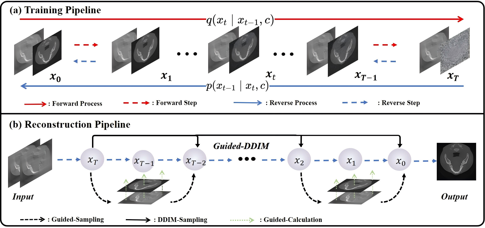
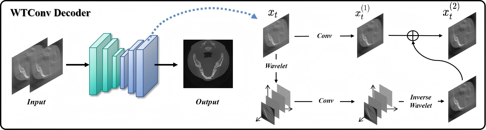

# PWD: Prior-Guided and Wavelet-Enhanced Diffusion Model for Fast Limited-Angle Imaging on Dental CT
[](https://arxiv.org/abs/2507.05317)
[](https://opensource.org/licenses/MIT)
This repository contains the official implementation of the paper **"PWD: Prior-Guided and Wavelet-Enhanced Diffusion Model for Fast Limited-Angle imaging on Dental CT"**.

## Abstract
Generative diffusion models have received increasing attention in medical imaging, particularly in limited-angle computed tomography (LACT). Standard diffusion models achieve high-quality image reconstruction，but require a large number of sampling steps during inference, resulting in substantial computational overhead.Although skip-sampling strategies have been proposed to improve efficiency, they often lead to loss of fine structuraldetails. To address this issue, we propose a prior information embedding and wavelet feature fusion fast sampling diffusion model for LACT reconstruction. The PWD enables efficient sampling while preserving reconstruction fidelity in LACT, and effectively mitigates the degradation
typically introduced by skip-sampling. Specifically, during the training phase, PWD maps the distribution of LACT images to that of fully sampled target images, enabling the model to learn structural correspondences between them.During inference, the LACT image serves as an explicit prior to guide the sampling trajectory, allowing for high quality reconstruction with significantly fewer steps. In addition, PWD performs multi-scale feature fusion in the wavelet domain, effectively enhancing the reconstruction of fine details by leveraging both low-frequency and high frequency information. Quantitative and qualitative evaluations on clinical dental arch CBCT and periapical datasets demonstrate that PWD outperforms existing methods under the same sampling condition. Using only 50 sampling steps, PWD achieves at least 1.7 dB improvement in PSNR and 10% gain in SSIM.

Index Terms— Limited-angle CT reconstruction, guided diffusion, fast sampling, wavelet convolution.

## Method Overview
<p align="center">
  
  <br>
  <em>Figure 1: Illustration of the training and sampling pipeline of PWD.</em>
</p>

<p align="center">
  
  <br>
  <em>Figure 2:The comparison of different data fidelity strategies. (a) shows projection-domain replacement-based fidelity, (b) depicts iterative algorithm based data fidelity, (c) illustrates the data fidelity approach adopted by PWD..</em>
</p>

<p align="center">
  
  <br>
  <em>Figure 3:The processing procedure of WTConv. WTConv enables the model to capture both global structures and high-frequency details during the decoding process, theeby enhancing the quality of image.</em>
</p>

## Results
<p align="center">
  
  <br>
  <em>Figure 4:Reconstruction results of different methods on the dental arch dataset with a scanning angle of 90°. The titles indicate the respective reconstruction methods. The second row displays the ROI regions of clinical interest, and the third row shows the difference maps between the reconstructed results and the reference images. The display window is [-900, 3700] HU.</em>
</p>   

<p align="center">
  
  <br>
  <em>Figure 5:Reconstruction results on the dental arch dataset at 120° scanning angle using different methods. The titles indicate the respective reconstruction methods. The second row shows the ROI regions of clinical interest. The third row presents the difference maps between the reconstructed images and the reference images. The display window is [-900, 3700] HU.</em>
</p>

<p align="center">
  
  <br>
  <em>Figure 6:Reconstruction results of different methods on the periapical dataset with a scanning angle of 90°. The titles indicate the respective reconstruction methods. The second row shows magnified details of dental structures. The third row displays residual maps comparing the reconstruction results to the Reference. The display window is [-900, 3500] HU.</em>
</p>

<p align="center">
  
  <br>
  <em>Figure 7:Reconstruction results of different methods on the periapical dataset with a scanning angle of 120°. The titles indicate the respective reconstruction methods. The second row shows magnified details of dental structures. The third row displays residual maps comparing the reconstruction results to the Reference. The display window is [-900, 3500] HU.</em>
</p>


## Citation
```bibtex
@article{liu2025pwd,
  title={PWD: Prior-Guided and Wavelet-Enhanced Diffusion Model for Fast Limited-Angle imaging on Dental CT},
  author={Liu, Yi and Wen, Yiyang and Zhou, Zekun and Ma, Junqi and Wang, Linghang and Yao, Yucheng and Shi, Liu and Liu, Qiegen},
  journal={arXiv preprint arXiv:2507.05317},
  year={2025}
}
